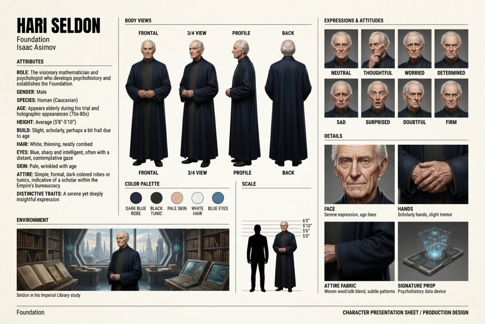

# 📖 Once Upon a Time

Turn any story into consistent illustrations of its characters, locations and key passages.

Give it a book title. It researches the book, builds a validated cast, and generates studio-style
character portraits and production-design sheets with Gemini on Vertex AI, keeping every character
the same across every image.

| Anchor portrait | Presentation sheet |
|---|---|
|  |  |
|  |  |
|  |  |

*The Little Prince* (cartoon) and *Foundation* (realistic). Locations get the same treatment,
here the farmyard from *The Ugly Duckling* in watercolor:


## What you get

- **A researched cast.** Characters, locations and key passages gathered from the web and validated
  against a strict schema. Nothing is invented: unknown fields stay `undefined`.
- **Faithful characters.** A talking fox is still a fox. If the research gets something wrong, write
  an author's note on the character and regenerate.
- **Consistent images.** One anchor portrait per character; every other image uses it as a
  reference, so identity never drifts.
- **Eight styles.** Cartoon, realistic, retro, anime, watercolor, comic, pixel-art, noir.
- **A PDF of the whole project**, and a running estimate of what every call cost.

## Quick start

```bash
gcloud auth application-default login     # Vertex AI must be enabled on your GCP project
git clone git@github.com:JohnBetaCode/Once_Upon_a_Time.git && cd Once_Upon_a_Time
docker compose up --build
```

Open http://localhost:8501, enter your GCP project ID in **Settings**, create a project, type a
book title, and press **Research book**.

## Learn more

- [User guide](docs/usage.md): setup, walkthrough, author's notes, PDF export, configuration, costs.
- [Architecture](docs/architecture.md): modules, data layout, pipelines, design decisions.
- [Original spec](docs/once-upon-a-time-spec.md).

Built with Streamlit, Pydantic and the Gemini API on Vertex AI. Ships Claude Code skills in
`.claude/skills/` for running, inspecting and documenting the project.
