# 📖 Once Upon a Time

Turn any story into **consistent** illustrations of its characters, locations and key passages.

Give the app a book title and it researches the book on the web, extracts a validated cast of
characters, locations and pivotal passages, and generates studio-style character portraits and
production-design presentation sheets with Gemini on Vertex AI, keeping every character
visually identical across images.

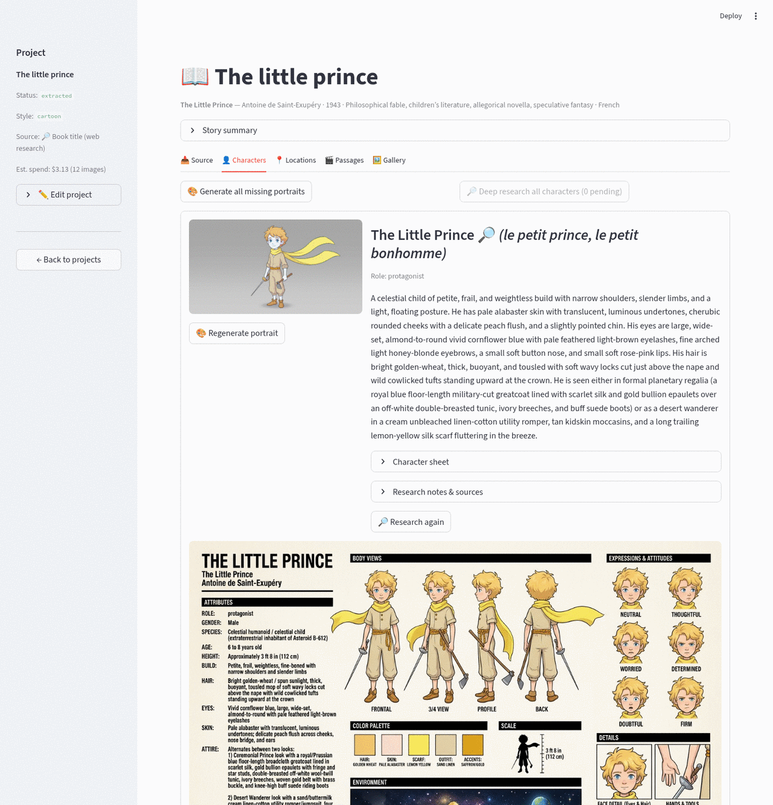

## What it does

- **Research a book from its title.** A web-grounded Gemini agent gathers the plot, every named
  character with a full visual profile, significant locations and 5-12 key passages, with source
  links kept alongside the notes.
- **Validate everything.** Research notes are converted into a strict Pydantic schema. Any attribute
  the model cannot ground becomes the literal string `undefined` instead of an invented fact.
- **Deep-research each character.** An optional per-character pass searches wikis, literature guides
  and adaptations to produce much richer character sheets (hair, eyes, attire, props, form).
- **Generate an anchor portrait per character**, faithful to the character's *form* (a talking fox
  stays a real fox, on four legs, no clothes, unless the book draws it otherwise).
- **Generate presentation sheets** (turnaround, expressions, palette, scale, details, environment)
  that reuse the anchor as a reference image, so identity does not drift.
- **Illustrate locations** with establishing shots and environment sheets.
- **Track cost.** Every API call is logged with token counts and an estimated USD cost, per project
  and per operation.
- **Export to PDF.** One click builds a document with the story summary, every character (portrait,
  attributes, presentation sheet), locations, key passages and research sources, whatever has been
  generated so far.

| Anchor portrait | Presentation sheet |
|---|---|
| 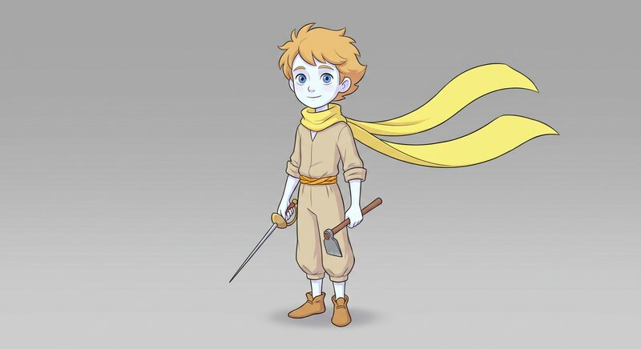 | 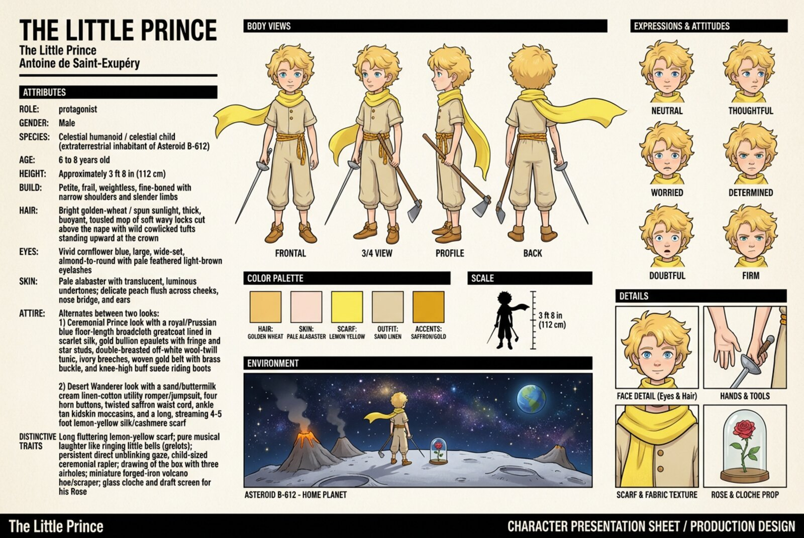 |
| 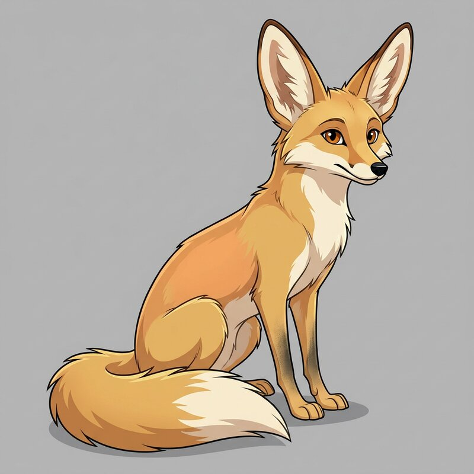 | 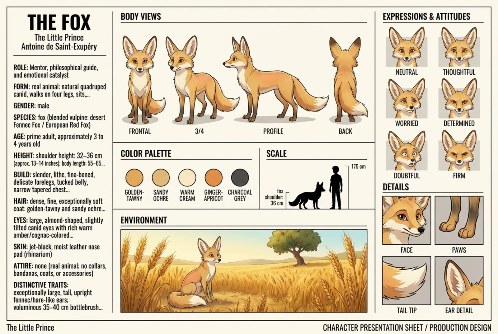 |

Location presentation sheet (watercolor style):

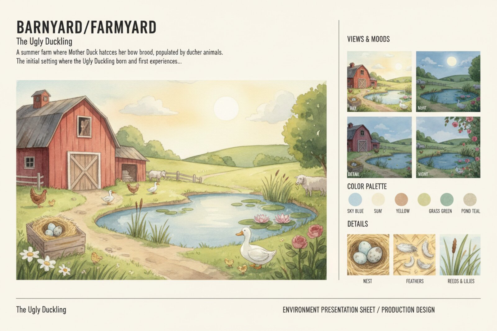

PDF export of a project (first pages):

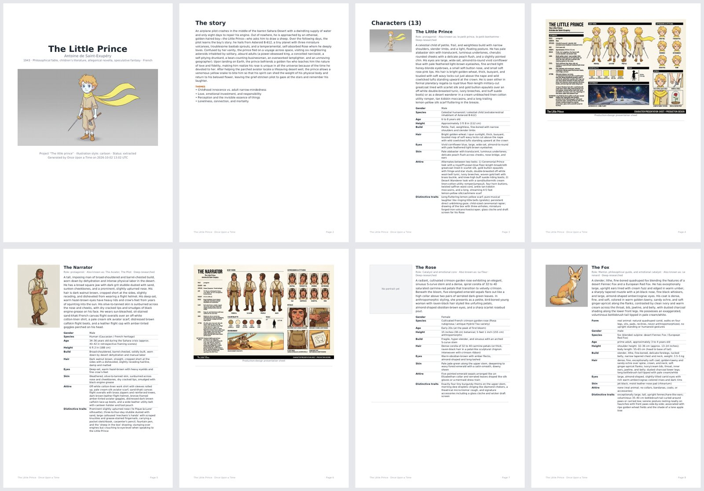

## How it works

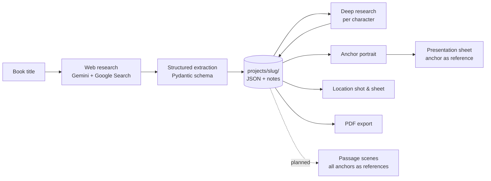

1. **Ingest.** A project has one source: a book title (implemented), pasted text or a PDF (saved,
   processing planned). Title ingestion runs a web-grounded research call and then a structured
   extraction call, because Google Search grounding and structured output cannot be combined in a
   single Gemini request.
2. **Persist.** Entities are written to `projects/<slug>/` as JSON next to the research notes.
   The folder is the source of truth; the UI reads it on every rerun.
3. **Anchor, then derive.** Each character gets one front-facing anchor portrait generated from its
   sheet. Every later image of that character passes the anchor PNG as a reference and instructs the
   model that *the reference image is the character* (text describes, the image decides).
4. **Account.** Every call appends a line to `data/usage.jsonl`; the home page and the
   `usage-report` skill summarize it.
5. **Export.** The sidebar's *Export PDF* panel renders the current state of the project folder
   into `projects/<slug>/exports/` with ReportLab; no API calls, so it costs nothing.

See [docs/architecture.md](docs/architecture.md) for modules, data layout and design decisions, and
[docs/once-upon-a-time-spec.md](docs/once-upon-a-time-spec.md) for the original product spec.

## Screenshots

| | |
|---|---|
| **Home**: settings, usage and projects<br/>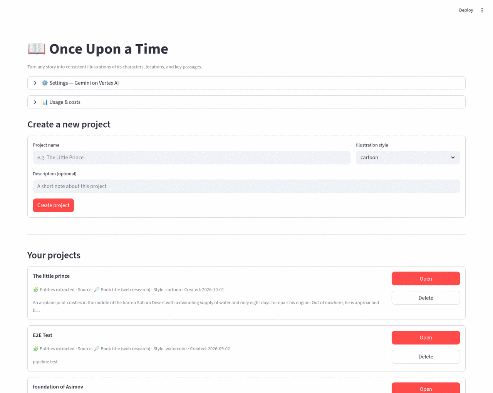 | **Usage & costs** per project and operation<br/>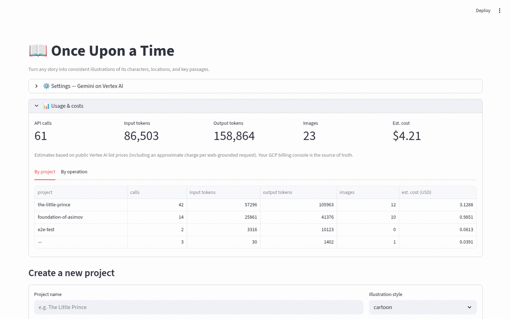 |
| **Source tab**: research notes and sources<br/>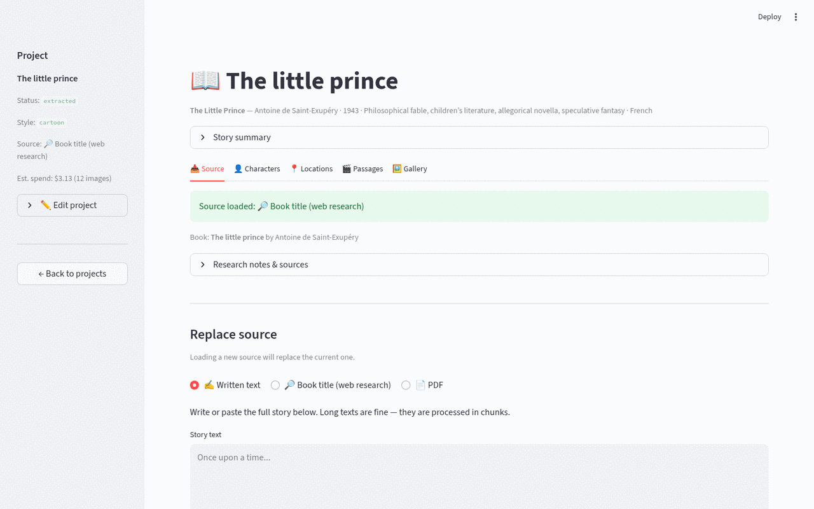 | **Locations tab**: establishing shots and sheets<br/>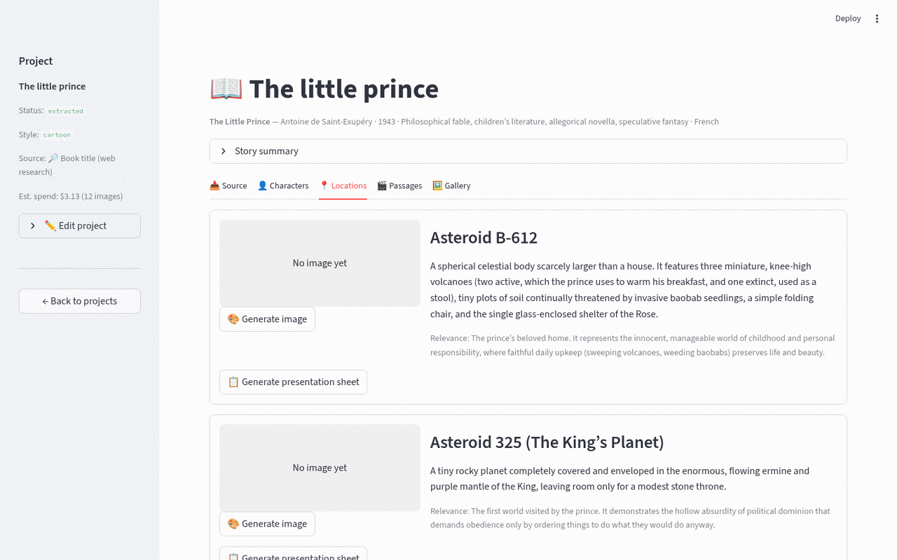 |
| **Passages tab**: key moments with cast and place<br/>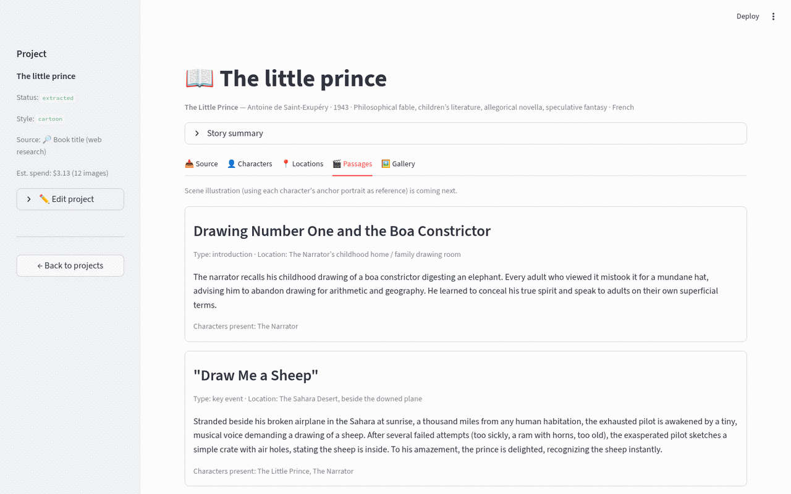 | **Gallery**: every image in the project<br/>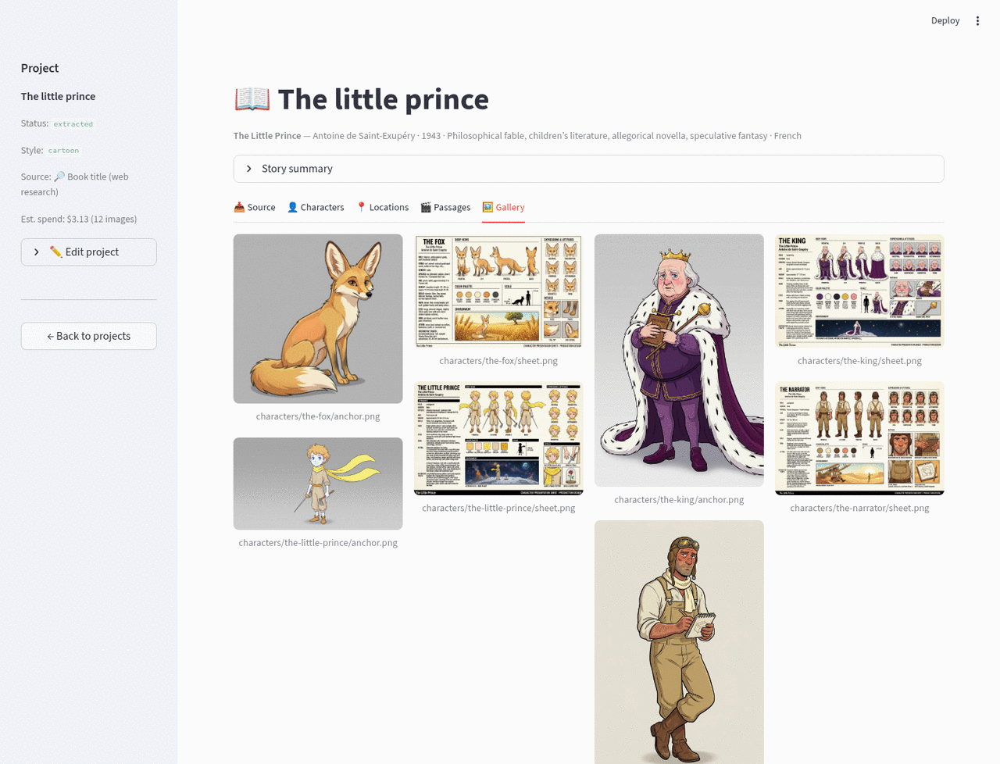 |
| **Export PDF** from the sidebar<br/>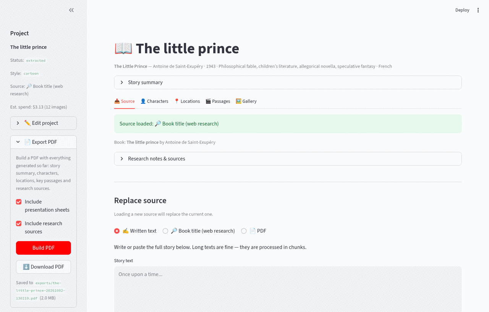 | |

## Getting started

### Prerequisites

- Docker with the Compose plugin (or Python 3.12 to run locally).
- A Google Cloud project with the **Vertex AI API** enabled and billing active.
- The [gcloud CLI](https://cloud.google.com/sdk/docs/install), authenticated with Application
  Default Credentials:

  ```bash
  gcloud auth application-default login
  ```

  The container mounts `~/.config/gcloud` read-only, so no key files are copied into the image.
  The caller needs the `roles/aiplatform.user` role on the project.

### Run with Docker

```bash
git clone git@github.com:JohnBetaCode/Once_Upon_a_Time.git
cd Once_Upon_a_Time
cp config/.env.example config/.env       # or set everything from the Settings panel later
docker compose up --build
```

Open http://localhost:8501. On first launch the **⚙️ Settings** panel is expanded: enter your GCP
project ID, keep the default models and locations unless you know otherwise, and click
**Save & test**. Settings are written to `config/.env` (git-ignored).

Code under `app/` is bind-mounted and hot-reloads. Rebuild only after changing
`requirements.txt` or the `Dockerfile`.

### Run locally

```bash
python3.12 -m venv .venv && source .venv/bin/activate
pip install -r requirements.txt
streamlit run app/main.py
```

### First project

1. **Create a project** on the home page and pick an illustration style.
2. In the **Source** tab choose *Book title*, type the title (author optional) and click
   **Research book**. Leave *Deep-research each character* on for richer sheets
   (about one minute for the book, then a few seconds per character).
3. In **Characters**, click **Generate all missing portraits**, then **Generate presentation sheet**
   on the characters you care about. Regenerate a portrait and the UI will warn that its sheet is
   stale.
4. **Locations** works the same way; **Gallery** shows everything generated so far.
5. Open **📄 Export PDF** in the sidebar, click **Build PDF** and download the document. Entities
   without images are listed as text, so you can export at any point.

## Configuration

Values live in `config/.env` and can be edited from the Settings panel.

| Variable                 | Default (`.env.example`) | Purpose                                                      |
|--------------------------|--------------------------|--------------------------------------------------------------|
| `GOOGLE_CLOUD_PROJECT`   | (required)               | GCP project that hosts Vertex AI and gets billed             |
| `GOOGLE_CLOUD_LOCATION`  | `global`                 | Region for the text model (research and extraction)          |
| `GEMINI_IMAGE_LOCATION`  | `global`                 | Region for the image model                                   |
| `GEMINI_TEXT_MODEL`      | `gemini-3.8-flash`       | Model for web research and structured extraction             |
| `GEMINI_IMAGE_MODEL`     | `gemini-3-pro-image`     | Image model (supports reference images for consistency)      |

Illustration styles available in the UI: `cartoon`, `realistic`, `retro`, `anime`, `watercolor`,
`comic`, `pixel-art`, `noir`. Each is a one-line style clause defined in
[app/core/imaging.py](app/core/imaging.py) and applied to every image prompt of the project.

## Costs

Estimates are computed from Vertex AI list prices in [app/core/usage.py](app/core/usage.py) and
shown in the **Usage & costs** panel. The GCP billing console is the source of truth.

| Operation                       | What it costs, roughly                                   |
|---------------------------------|----------------------------------------------------------|
| Book research (title)           | one grounded request plus one extraction, a few cents    |
| Deep research per character     | one grounded request plus one extraction, $0.05-0.10     |
| Anchor portrait or sheet        | one image generation, about $0.13-0.20 per image         |

Generating portraits and sheets for a 13-character book comes to roughly $3-5.

## Project layout

```
app/
  main.py              Streamlit entry point (home vs. project workspace)
  core/
    config.py          Settings from config/.env; Settings panel writes it back
    gemini.py          Vertex AI client: web research, structured extraction, image generation
    research.py        Research and extraction prompts for books and characters
    schema.py          Pydantic models (BookExtraction, Character, Location, Passage)
    ingestion.py       Source persistence, extraction persistence, deep research
    imaging.py         Style clauses, image prompts, anchor and sheet generation
    export.py          PDF export of the project state (ReportLab)
    projects.py        Project folders and project.json
    usage.py           Token/cost accounting (data/usage.jsonl)
  ui/
    home.py            Settings, usage panel, create/open/delete projects
    workspace.py       Sidebar + Source / Characters / Locations / Passages / Gallery tabs
config/
  .env.example         Template; copy to .env (git-ignored)
docs/
  architecture.md      How the app is actually built
  once-upon-a-time-spec.md   Original product spec
  images/              README screenshots and sample outputs
projects/<slug>/       Per-project data (git-ignored): project.json, source/, characters/, locations/, passages/
data/usage.jsonl       Cost log (git-ignored)
.claude/skills/        Claude Code skills for working on this repo
```

Per-project data on disk:

```
projects/the-little-prince/
  project.json                           status, style, source, book metadata
  source/research.md                     web research notes + sources
  characters/characters.json             validated character list
  characters/the-fox/anchor.png          anchor portrait
  characters/the-fox/sheet.png           presentation sheet
  characters/the-fox/research.md         deep-research notes
  locations/locations.json
  locations/asteroid-b-612.png           establishing shot
  locations/asteroid-b-612-sheet.png     environment sheet
  passages/passages.json
  exports/the-little-prince-20261002-130219.pdf   PDF exports
```

## Status and roadmap

| Capability                                        | Status      |
|---------------------------------------------------|-------------|
| Projects with per-project style and metadata      | done        |
| Title ingestion: web research + validated extraction | done     |
| Per-character deep research with sources           | done        |
| Character anchor portraits with form fidelity      | done        |
| Character presentation sheets (anchor as reference)| done        |
| Location establishing shots and sheets             | done        |
| Usage and cost accounting                          | done        |
| PDF export of the project (summary, characters, locations, passages, sources) | done |
| Passage scene illustration (anchors of the cast as references) | planned |
| Derived shots per character (side, back, full body) as separate images | planned |
| Pasted-text ingestion (chunked extraction with overlap) | saved only; processing planned |
| PDF ingestion (text extraction, OCR fallback)      | saved only; processing planned |
| Background job queue and resumable per-item status | planned (everything runs inline today) |

## Working on the repo with Claude Code

The repository ships skills under `.claude/skills/` that Claude Code picks up automatically:

| Skill                  | Use it for                                                           |
|------------------------|----------------------------------------------------------------------|
| `run-app`              | start/stop/rebuild the stack, logs, debugging credentials and models |
| `screenshots`          | regenerate the README screenshots with Playwright + system Chrome    |
| `usage-report`         | cost reports from `data/usage.jsonl`; keeping `PRICING` current      |
| `inspect-project`      | audit a project folder: missing/stale images, undefined fields, orphans |
| `illustration-prompts` | editing image/research prompts, styles, consistency rules, scenes    |

See [CLAUDE.md](CLAUDE.md) for conventions.
