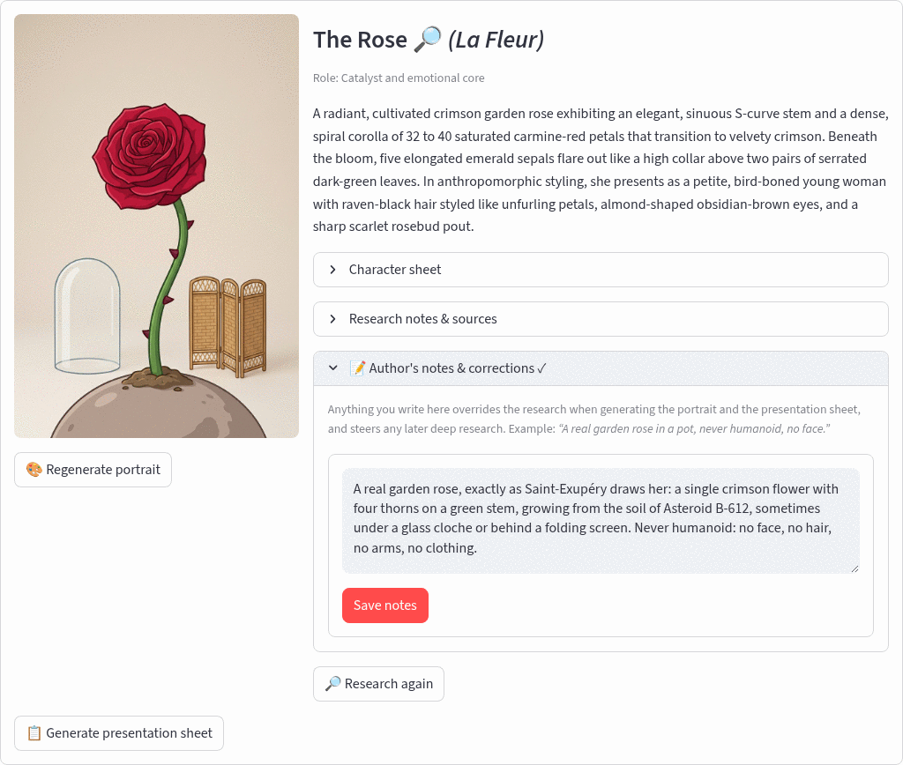

# User guide

How to install, run and use Once Upon a Time. For how it is built, see
[architecture.md](architecture.md).

## Contents

1. [Prerequisites](#prerequisites)
2. [Run with Docker](#run-with-docker)
3. [Run locally](#run-locally)
4. [Your first project](#your-first-project)
5. [Correcting a character with author's notes](#correcting-a-character-with-authors-notes)
6. [Exporting a PDF](#exporting-a-pdf)
7. [Configuration](#configuration)
8. [Costs](#costs)
9. [Where your data lives](#where-your-data-lives)
10. [Status and roadmap](#status-and-roadmap)
11. [Working on the repo with Claude Code](#working-on-the-repo-with-claude-code)

## Prerequisites

- Docker with the Compose plugin (or Python 3.12 to run locally).
- A Google Cloud project with the **Vertex AI API** enabled and billing active.
- The [gcloud CLI](https://cloud.google.com/sdk/docs/install), authenticated with Application
  Default Credentials:

  ```bash
  gcloud auth application-default login
  ```

  The container mounts `~/.config/gcloud` read-only, so no key files are copied into the image.
  The caller needs the `roles/aiplatform.user` role on the project.

## Run with Docker

```bash
git clone git@github.com:JohnBetaCode/Once_Upon_a_Time.git
cd Once_Upon_a_Time
cp config/.env.example config/.env       # optional: everything can be set from the Settings panel
docker compose up --build
```

Open http://localhost:8501. On first launch the **⚙️ Settings** panel is expanded: enter your GCP
project ID, keep the default models and locations unless you know otherwise, and click
**Save & test**. Settings are written to `config/.env` (git-ignored).


Code under `app/` is bind-mounted and hot-reloads. Rebuild only after changing
`requirements.txt` or the `Dockerfile`.

## Run locally

```bash
python3.12 -m venv .venv && source .venv/bin/activate
pip install -r requirements.txt
streamlit run app/main.py
```

The PDF export uses DejaVu Sans when it is installed (`fonts-dejavu-core` on Debian/Ubuntu) and
falls back to Helvetica otherwise.

## Your first project

1. **Create a project** on the home page and pick an illustration style. The style applies to every
   image of the project; you can change it later from the sidebar (new generations only).
2. In the **Source** tab choose *Book title*, type the title (author optional) and click
   **Research book**. A web-grounded agent gathers the plot, cast, locations and key passages, then
   a second call converts the notes into validated JSON. Leave *Deep-research each character* on for
   much richer character sheets (about one minute for the book, then a few seconds per character).

   

3. In **Characters**, click **Generate all missing portraits**. Each character gets one front-facing
   *anchor* portrait. Then click **Generate presentation sheet** on the characters you care about:
   the sheet (turnaround, expressions, palette, scale, details, environment) uses the anchor as a
   reference image, so it shows the same individual. If you regenerate a portrait, the UI warns that
   its sheet is stale.

   

4. **Locations** works the same way: an establishing shot, then an environment sheet.
5. **Passages** lists the key moments with their cast and place. Scene illustration is planned.
6. **Gallery** shows every image in the project.

## Correcting a character with author's notes

Research is grounded in web sources and sometimes follows an adaptation rather than the book
(The Rose in *The Little Prince* came out humanoid). Open **📝 Author's notes & corrections** on the
character card, write what should be true, and save:

> A real garden rose, exactly as Saint-Exupéry draws her: a single crimson flower with four thorns
> on a green stem, growing from the soil of Asteroid B-612. Never humanoid: no face, no hair, no
> arms, no clothing.



The note is injected with top priority into the portrait and sheet prompts and into any later
"Research again" or deep research of that character, and it survives re-research. After saving,
regenerate the portrait, then the sheet. The card warns while the portrait is older than the note.

## Exporting a PDF

Open **📄 Export PDF** in the sidebar, choose whether to include presentation sheets and research
sources, and click **Build PDF**. The document contains a cover, the story summary and themes, every
character (portrait, attributes, author's notes, sheet), locations, key passages and an appendix of
sources with links. Entities without images are listed as text, so you can export at any point.


Files are saved under `projects/<slug>/exports/` with a timestamp and offered for download. A
13-character book exports to about 2 MB in under a second; no API calls are made.


## Configuration

Values live in `config/.env` and can be edited from the Settings panel.

| Variable                 | Default (`.env.example`) | Purpose                                                      |
|--------------------------|--------------------------|--------------------------------------------------------------|
| `GOOGLE_CLOUD_PROJECT`   | (required)               | GCP project that hosts Vertex AI and gets billed             |
| `GOOGLE_CLOUD_LOCATION`  | `global`                 | Region for the text model (research and extraction)          |
| `GEMINI_IMAGE_LOCATION`  | `global`                 | Region for the image model                                   |
| `GEMINI_TEXT_MODEL`      | `gemini-3.8-flash`       | Model for web research and structured extraction             |
| `GEMINI_IMAGE_MODEL`     | `gemini-3-pro-image`     | Image model (supports reference images for consistency)      |

Illustration styles: `cartoon`, `realistic`, `retro`, `anime`, `watercolor`, `comic`, `pixel-art`,
`noir`. Each is a one-line style clause in `app/core/imaging.py` applied to every image prompt.

## Costs

Estimates are computed from Vertex AI list prices in `app/core/usage.py` and shown in the
**Usage & costs** panel on the home page, per project and per operation. The GCP billing console
is the source of truth.


| Operation                       | What it costs, roughly                                   |
|---------------------------------|----------------------------------------------------------|
| Book research (title)           | one grounded request plus one extraction, a few cents    |
| Deep research per character     | one grounded request plus one extraction, $0.05-0.10     |
| Anchor portrait or sheet        | one image generation, about $0.13-0.20 per image         |
| PDF export                      | free                                                     |

Portraits and sheets for a 13-character book come to roughly $3-5.

## Where your data lives

Everything is plain files; there is no database. `projects/`, `data/` and `config/.env` are
git-ignored.

```
projects/the-little-prince/
  project.json                           status, style, source, book metadata
  source/research.md                     web research notes + sources
  characters/characters.json             validated character list (+ author's notes)
  characters/the-fox/anchor.png          anchor portrait
  characters/the-fox/sheet.png           presentation sheet
  characters/the-fox/research.md         deep-research notes
  locations/locations.json
  locations/asteroid-b-612.png           establishing shot
  locations/asteroid-b-612-sheet.png     environment sheet
  passages/passages.json
  exports/the-little-prince-<stamp>.pdf  PDF exports
data/usage.jsonl                         one line per API call with tokens and estimated cost
```

Deleting a project from the home page removes its folder. The usage log keeps its history.

## Status and roadmap

| Capability                                        | Status      |
|---------------------------------------------------|-------------|
| Projects with per-project style and metadata      | done        |
| Title ingestion: web research + validated extraction | done     |
| Per-character deep research with sources           | done        |
| Character anchor portraits with form fidelity      | done        |
| Character presentation sheets (anchor as reference)| done        |
| Author's notes per character                       | done        |
| Location establishing shots and sheets             | done        |
| Usage and cost accounting                          | done        |
| PDF export                                         | done        |
| Passage scene illustration (anchors of the cast as references) | planned |
| Derived shots per character as separate images     | planned     |
| Pasted-text ingestion (chunked extraction)         | saved only; processing planned |
| PDF ingestion (text extraction, OCR fallback)      | saved only; processing planned |
| Background job queue and resumable per-item status | planned (everything runs inline today) |

## Working on the repo with Claude Code

Skills under `.claude/skills/` are picked up automatically:

| Skill                  | Use it for                                                           |
|------------------------|----------------------------------------------------------------------|
| `run-app`              | start/stop/rebuild the stack, logs, debugging credentials and models |
| `screenshots`          | regenerate the documentation screenshots with Playwright + system Chrome |
| `usage-report`         | cost reports from `data/usage.jsonl`; keeping `PRICING` current      |
| `inspect-project`      | audit a project folder: missing/stale images, undefined fields, orphans |
| `illustration-prompts` | editing image/research prompts, styles, consistency rules, scenes    |

See [CLAUDE.md](../CLAUDE.md) for conventions.
